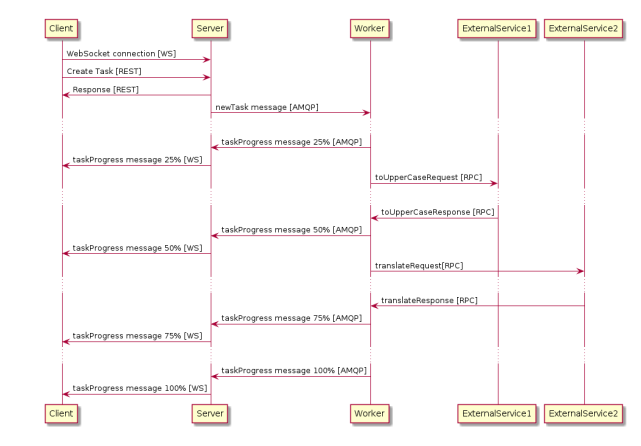

# TecnologiasServiciosInternet_ProtocolsAndReactivity_Practice3Bis
Practice 3Bis for  "Tecnologías y Servicios de Internet" subject. Protocols &amp; Reactivity

# Work to do

An application containing the following services is to be created:
- Client
- Server
- Worker
- External Service 1
- External Service 2

The following diagram shows how this services communicate among them.



## Client
- It will be executed on a web browser
- It will be able to invoke an API REST provided by _server_.
- It will connect using _WebSocket_ in order to receive messages with the progress of the task launched.
- Whan a task is created, a text to the _server_ is send.
- It will be served as static http in the _server's web server_.
- It will be implementes as AJAX: JavaScript code calling the API REST and the _server's websockets endpoint_.
- Client's web will show the already executed task in e server and the progress of each one of them at the requested moment.
- It also will have a form in order to include text and a button in order to create a task with that name. When this button is pushed a REST request will be done to the _server_ to ask for the execution of that task. The response of that creation response will return inmediatelly returning a *0% progress*. The creation will progress in the _server_ some additional seconds.
- As the task's execution progresses _Client_ will receive messages through the websocket with the progress. The web site must show this progress. A "Progress: XX%" is enough.
- The interface will only allow to create one task at a time. In order to do that it will disable the button until completed.
- When the progress message reaches 100% the list of tasks will be updated.
- The web will be available in _http://127.0.0.1:3000_

## Server
- It will offer an API REST in order to create, list and delete tasks.
- It will be implemented with Node.js and with a MySQL database.
- It will be assumed that the completition of the tasks takes too much time and can not be done in the context of a REST request.
- Each time a task is requested, the server returns inmediatelly the task id to the _client_ and the task is ready to be launched on the background.
- _Client_ can request the percentage of completion of the task using the id of the previous point.
- The API request and messages could be:
  * URL */tasks/*
  * Request body: ```{ text: 'content' } ```
  * Response body: ```{ id:1, text:'content', progress: 0, completed: false}```
- _Client_ can connect to a WebSocket in order to receive an event each time the task updates its completion percentage. In order to do that it must 'suscribe' explicitly in order to receive updates with the following message: 
  * ```{ type: 'suscription' , task-id:0}```
- The progress update format will be:
  * ```{ id: 0, completed: false, progress: 10 }```
- When the task ends, the format of the message will be:
  * ```{id: 0, completed: true, progress: 100, result: ‘CONTENT’}```
- It is assumed that task are intensive and executed on the _WORKER_ service.
- _Server_ notifies _Worker_ using a AMQP with RabbitMQ. The message will carry the text send by the client.
  * *createTask* will be the name of the queue and it is assumed that it is already created in RabbitMQ.
  * Messages will be JSON with format: ```{ id: 0, text: “content” }```
- _Server_ will be created by server (if it is not created)
- Several parallel client management is to be allowed

## Worker

# Usage

## Environment configuration
It is compulsory to launch the following commands in order to create the docker containers

### Creating the MongoDB container
- In shell:
    ```shell script
    $ docker run --name mongo-db  -p 27017:27017 -d mongo:latest
    ```
  
### Creating the MySQL container
- In shell:
    ```shell script
    $ docker run --name mysql-db -p 3306:3306 -e MYSQL_ROOT_PASSWORD=pass -e MYSQL_DATABASE=tasksDB -d mysql:latest
    ```
  
### Creating the RabbitMQ container
- In shell:
    ```shell script
    $ docker run --name rabbitMQ -p 5672:5672 -p 15672:15672 -d rabbitmq:3-management
    ```
  
# Author

👤 **Jaime Hernández Ortiz**

* Github: [@zuldare](https://github.com/zuldare)

Note that you should have to:
- [install JDK 8](https://www.oracle.com/java/technologies/javase/javase-jdk8-downloads.html) and [Maven](https://maven.apache.org/install.html) as prerequisite.
- [install Node](http://www.google.com) as prerequisite